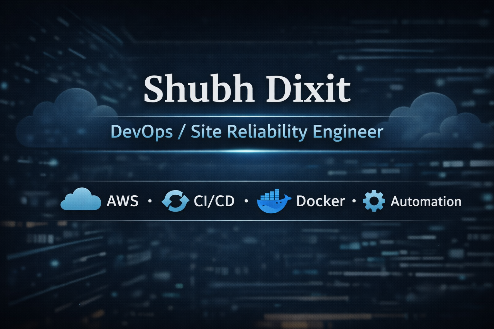

# 🚀 DevOps Portfolio Website

A modern, responsive portfolio website showcasing my skills, projects, and experience as a **DevOps & Site Reliability Engineer**.

## 🌐 Live Demo

**Website:** https://shubhdixit.cloud/

---

## 📌 About

This portfolio highlights my experience in:

- ☁️ AWS Cloud Infrastructure
- 🔁 CI/CD Automation
- 🐳 Docker & Containerization
- ⚙️ Infrastructure Automation
- 📊 Monitoring & Observability
- 🐧 Linux Administration
- 🔒 DevOps Best Practices

The website is built with lightweight technologies to ensure fast loading and easy deployment.

---

## 🛠️ Tech Stack

- HTML5
- CSS3
- JavaScript
- GitHub Actions (CI)
- Git & GitHub

---

## 📂 Project Structure

```
.
├── .github/
│   └── workflows/
│       └── ci.yml
├── assets/
│   ├── css/
│   ├── img/
│   └── js/
├── index.html
├── Shubh_Dixit_SRE_DevOps.pdf
└── README.md
```

---

## ✨ Features

- Responsive design
- Modern UI
- SEO optimized
- Open Graph & Twitter metadata
- Resume download
- GitHub & LinkedIn integration
- Lightweight and fast
- GitHub Actions CI workflow

---

## ⚙️ GitHub Actions

The repository includes a simple CI workflow that runs on every push to the `main` branch.

Current workflow:

- Checkout repository
- Validate project files
- Complete CI pipeline

Location:

```
.github/workflows/ci.yml
```

---

## 🚀 Running Locally

Clone the repository:

```bash
git clone https://github.com/shubhdixitnoogler/devops-portfolio.git
```

Navigate into the project:

```bash
cd devops-portfolio
```
Open `index.html` in your browser.

Or use VS Code Live Server.

---

## 📸 Preview



---

## 📄 Resume

Download the latest resume directly from the portfolio:

```
Shubh_Dixit_SRE_DevOps.pdf
```

---

## 📫 Connect With Me

- 🌐 Website: https://shubhdixit.cloud
- 💼 LinkedIn: https://linkedin.com/in/shubhdixitnoogler
- 💻 GitHub: https://github.com/shubhdixitnoogler

---

## ⭐ Future Improvements

- Terraform project showcase
- Kubernetes deployment demos
- Monitoring dashboards
- Blog section
- Dark/Light theme toggle
- Contact form backend

---

## 📜 License

This project is open source and available under the MIT License.

---

### ⭐ If you like this project, consider giving it a star!
